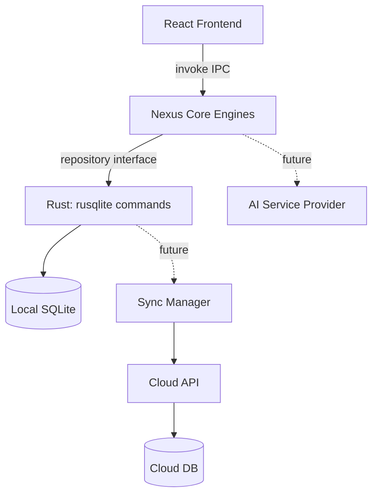

# H.A.A. Nexus — Architecture Package (Phase 0)

**Status:** Architecture only. Nothing in this document is implemented. This is the design that Phases 1–13 will build against, per the Master Specification's own directive not to produce application code before architecture is established.

---

## 1. Executive Summary

H.A.A. Nexus is a healthcare training, simulation, assessment, and competency platform. It is not a single app with a scribing quiz bolted on — it is a reusable training engine (**Nexus Core**) that the **Live Scribing Simulator** is the first tenant of. Every design decision below is made so that a second module (e.g., Medical Coding) can be added later by writing new content and a new UI shell, without touching the scoring engine, competency engine, persistence layer, or sync layer.

The MVP is a **Tauri desktop application** (Windows first) backed by **local SQLite**, fully functional offline, with a **deterministic rule-based evaluation engine** for documentation scoring. AI, cloud sync, subscriptions, and instructor/org tooling are architected for but explicitly not built in the MVP.

Priority order (per spec Section 80): training usefulness → accuracy → reliability → data integrity → maintainability → offline function → extensibility → security/privacy → performance → visual polish → AI → commercial features.

---

## 2. Product Architecture

```
H.A.A. Nexus
 └─ Nexus Core (shared engine services)
     ├─ Live Scribing (Module 1 — MVP)
     ├─ Medical Billing (future module)
     ├─ Insurance Verification (future module)
     ├─ Medical Coding (future module)
     ├─ HIPAA & Privacy (future module)
     ├─ Healthcare Administration (future module)
     ├─ Clinical Documentation (future module)
     └─ Healthcare Operations (future module)
```

Each module is a thin layer that maps its own domain onto the same core pipeline:

| Module | Input | Task | Evaluated against |
|---|---|---|---|
| Live Scribing | Encounter transcript | Free-text documentation | Required elements, terminology, unsupported inference |
| Medical Billing (future) | Case + insurance data | Coding/claim task | Code accuracy, completeness |
| Insurance Verification (future) | Patient + payer data | Verification workflow | Correct verification decisions |
| Medical Coding (future) | Clinical note | Code selection | Correct code set |
| HIPAA & Privacy (future) | Compliance scenario | Decision task | Correct/incorrect handling |

A module never implements its own scoring, competency, or persistence logic — it supplies **content** (scenario schema instances) and a **UI workspace**, and calls Nexus Core services.

---

## 3. System Architecture

Nexus Core is organized into engine services, each independently testable and UI-agnostic:

- **Content/Scenario Engine** — loads, validates, and versions scenario packages.
- **Simulation Engine** — manages session lifecycle, timers, pause/resume, flags.
- **Evaluation Engine** — parses learner documentation, classifies each statement (correct / omission / unsupported inference / fabrication), scores it.
- **Terminology Engine** — lay↔clinical term matching with accepted variants.
- **Competency Engine** — rolls evaluation history into per-skill competency levels.
- **Recommendation Engine** — deterministic rules mapping error patterns → remediation.
- **Analytics Engine** — aggregates session/evaluation history into dashboards.
- **Persistence Layer** — repository interfaces over SQLite (MVP) / cloud API (future).
- **AI Service Layer** — abstract interface; `NullAIProvider` in MVP.
- **Entitlement Engine** — feature-flag resolution from subscription tier (defaults to FREE-unlocked locally in MVP).
- **Sync Engine** (future) — outbox-pattern queue for cloud reconciliation.
- **Update Engine** (future) — separates app/content/config/module updates.

None of these engines import UI code. The UI imports engine interfaces, never the reverse.

---

## 4. Architecture Diagram

```
┌──────────────────────────────── Tauri Desktop App ────────────────────────────────┐
│                                                                                     │
│  ┌────────────── Frontend (React + TS, WebView) ──────────────┐                    │
│  │  Dashboard | Live Scribing UI | Training UI | KB UI | ...   │                    │
│  │             (calls Nexus Core via typed IPC bridge)         │                    │
│  └───────────────────────────┬───────────────────────────────┘                    │
│                               │ invoke() / event bus                               │
│  ┌───────────────────────────▼───────────────────────────────┐                    │
│  │                Nexus Core (TS, shared package)              │                    │
│  │  Scenario Eng. │ Simulation Eng. │ Evaluation Eng.           │                    │
│  │  Terminology   │ Competency Eng. │ Recommendation Eng.       │                    │
│  │  Analytics     │ Entitlements    │ AI Service (Null in MVP)  │                    │
│  └───────────────────────────┬───────────────────────────────┘                    │
│                               │ repository interface                                │
│  ┌───────────────────────────▼───────────────────────────────┐                    │
│  │        Rust backend (src-tauri): SQLite via rusqlite         │                    │
│  │        Commands: db_query, db_exec, file I/O, keychain       │                    │
│  └───────────────────────────┬───────────────────────────────┘                    │
│                               │                                                     │
│                     ┌─────────▼─────────┐                                          │
│                     │  local SQLite DB   │                                          │
│                     └────────────────────┘                                          │
└─────────────────────────────────────────────────────────────────────────────────────┘

Future, not MVP:
Local SQLite → Sync Manager (outbox) → REST API → Cloud DB
AI Service Layer → Anthropic/other provider (behind canUseAI entitlement)
```

Mermaid version (for tooling that renders it):



---

## 5. Module Architecture

A module is a directory contract, not a special-cased code path:

```ts
interface NexusModule {
  id: string;                     // "live-scribing"
  scenarioSchemaVersion: string;  // validated by content engine
  workspaceComponent: React.ComponentType<SessionProps>;
  defaultScoringWeights: ScoringWeights;
  competencyDomains: string[];    // e.g. ["HPI", "ROS", "Terminology", ...]
}
```

Live Scribing registers itself this way; Nexus Core has zero `if (module === 'live-scribing')` branches. This directly satisfies the spec's ban on scenario/module-specific hardcoding (Section 55/85).

---

## 6. Technology Stack — and the trade-offs behind it

The spec leaves the stack open ("a reasonable architecture may use...") but asks for justified choices, not popularity picks. Recommendations below are **proposals**, flagged as such since they go beyond what the spec mandates.

| Layer | Choice | Why | Alternative considered |
|---|---|---|---|
| Frontend | React 18 + TypeScript + Vite | Large ecosystem, works identically inside Tauri's WebView and a future pure-web build; TS gives compile-time safety for scenario/evaluation types | Svelte (smaller bundle, less hiring/community depth); vanilla JS (rejected — this app's data models are complex enough to benefit from types) |
| Desktop shell | Tauri v2 | Explicit spec requirement; Rust backend keeps binary small and gives real native packaging (installer, updater) instead of an Electron wrapper | Electron (rejected — spec explicitly wants Tauri, and Electron ships a full Chromium+Node runtime, working against "must not feel like a browser wrapper") |
| Local DB access | `rusqlite` directly in Rust commands, not `tauri-plugin-sql` | Session-interruption-safety (spec Section 29/61) needs explicit WAL mode, `synchronous=NORMAL`, and transaction control around autosave; rusqlite exposes those knobs directly. tauri-plugin-sql (via sqlx) is simpler to wire up but adds an abstraction layer between us and those pragmas. | tauri-plugin-sql (simpler, faster to start, revisit if rusqlite friction is high) |
| State (frontend) | Zustand | Minimal boilerplate for session/timer state; avoids over-engineering a Redux store for an MVP-scale app | Redux Toolkit (fine, but heavier than needed here) |
| Schema validation | Zod | Runtime + compile-time validation of scenario JSON packages and API payloads — required by the "content QA" mandate (Section 60/28) | JSON Schema + ajv (viable alternative; Zod chosen for TS-native inference) |
| Monorepo | pnpm workspaces | Enables `packages/nexus-core` to be imported by both the Tauri app and, later, a web build or a second module's app shell, without publishing to a registry | npm workspaces (works too; pnpm chosen for disk efficiency and stricter dependency isolation) |
| Testing | Vitest (TS unit/integration), `cargo test` (Rust commands), Playwright via `tauri-driver` (e2e) | Matches the three testing tiers required in Section 22 (Project Instructions) / Section 58 (Master Spec) | Jest (Vitest chosen for Vite-native speed) |

No AI SDK, cloud SDK, or payment SDK is added at this phase — consistent with the "AI-independent core" and "no payment processing in MVP" rules.

---

## 7. Folder Structure

```
haa-nexus/
├── apps/
│   └── desktop/                      # Tauri application (the MVP shell)
│       ├── src/                      # React frontend
│       │   ├── routes/               # Dashboard, LiveScribing, Training, KB, Analytics, Settings
│       │   ├── components/           # Shared UI primitives (buttons, cards, timers)
│       │   └── modules/
│       │       └── live-scribing/    # Module-specific UI only (workspace, transcript view)
│       └── src-tauri/                # Rust backend
│           ├── src/
│           │   ├── db/               # rusqlite connection, migrations, repository commands
│           │   ├── commands/         # #[tauri::command] functions exposed to frontend
│           │   └── main.rs
│           └── tauri.conf.json
├── packages/
│   ├── nexus-core/                   # Pure TS, no UI, no Tauri imports
│   │   └── src/
│   │       ├── scenario-engine/
│   │       ├── simulation-engine/
│   │       ├── evaluation-engine/
│   │       ├── terminology-engine/
│   │       ├── competency-engine/
│   │       ├── recommendation-engine/
│   │       ├── analytics-engine/
│   │       ├── entitlement-engine/
│   │       ├── ai-service/           # interface + NullAIProvider
│   │       ├── persistence/          # repository interfaces + types
│   │       └── types/                # shared TS types (Scenario, Session, EvaluationResult, ...)
│   └── ui-kit/                       # Shared, module-agnostic React components
├── content/
│   ├── scenarios/live-scribing/      # versioned JSON scenario packages
│   ├── terminology/                  # terminology dictionary JSON
│   └── lessons/                      # training lesson content
├── tests/
│   ├── unit/
│   ├── integration/
│   └── e2e/
└── docs/
    └── HAA_Nexus_Architecture_Package.md   # this document
```

`packages/nexus-core` never imports from `apps/desktop`. This is the enforceable version of "separation of concerns" — it's a real dependency-direction rule, not just a convention.

---

## 8. Database Schema (SQLite — MVP entities only)

```sql
PRAGMA journal_mode = WAL;
PRAGMA foreign_keys = ON;

CREATE TABLE users (
    id              TEXT PRIMARY KEY,          -- local UUID, no auth in MVP
    display_name    TEXT NOT NULL,
    created_at      TEXT NOT NULL,
    updated_at      TEXT NOT NULL
);

CREATE TABLE user_settings (
    user_id         TEXT PRIMARY KEY REFERENCES users(id),
    theme           TEXT DEFAULT 'clinical-light',
    accessibility_json TEXT,                    -- font size, contrast, etc.
    updated_at      TEXT NOT NULL
);

CREATE TABLE scenarios (
    scenario_id     TEXT NOT NULL,               -- e.g. "SCRIBE-OBGYN-001"
    latest_version  TEXT NOT NULL,
    title           TEXT NOT NULL,
    specialty       TEXT NOT NULL,
    encounter_type  TEXT NOT NULL,
    difficulty      INTEGER NOT NULL CHECK (difficulty BETWEEN 1 AND 6),
    tags_json       TEXT,
    is_active       INTEGER NOT NULL DEFAULT 1,
    PRIMARY KEY (scenario_id)
);

CREATE TABLE scenario_versions (
    scenario_id     TEXT NOT NULL,
    version         TEXT NOT NULL,               -- e.g. "1.2"
    content_json    TEXT NOT NULL,                -- full validated scenario package (Section 9)
    content_hash    TEXT NOT NULL,                -- for content QA / integrity check
    created_at      TEXT NOT NULL,
    PRIMARY KEY (scenario_id, version),
    FOREIGN KEY (scenario_id) REFERENCES scenarios(scenario_id)
);

CREATE TABLE terminology (
    id              TEXT PRIMARY KEY,
    lay_term        TEXT NOT NULL,
    clinical_term   TEXT NOT NULL,
    accepted_alternatives_json TEXT,              -- JSON array
    category        TEXT,
    context         TEXT,
    explanation     TEXT,
    common_mistakes_json TEXT
);
CREATE INDEX idx_terminology_lay ON terminology(lay_term);

CREATE TABLE training_lessons (
    id              TEXT PRIMARY KEY,
    title           TEXT NOT NULL,
    category        TEXT NOT NULL,
    content_json    TEXT NOT NULL,                -- explanation, examples, exercises, checks
    version         TEXT NOT NULL
);

CREATE TABLE simulation_sessions (
    id              TEXT PRIMARY KEY,
    user_id         TEXT NOT NULL REFERENCES users(id),
    scenario_id     TEXT NOT NULL,
    scenario_version TEXT NOT NULL,
    mode            TEXT NOT NULL CHECK (mode IN ('learning','practice','simulation','assessment')),
    status          TEXT NOT NULL CHECK (status IN
                      ('not_started','in_progress','paused','completed',
                       'interrupted','abandoned','evaluation_failed','retried')),
    started_at      TEXT,
    active_ms       INTEGER DEFAULT 0,
    paused_ms       INTEGER DEFAULT 0,
    completed_at    TEXT,
    flags_json      TEXT,                          -- flagged items during session
    FOREIGN KEY (scenario_id, scenario_version) REFERENCES scenario_versions(scenario_id, version)
);

CREATE TABLE documentation_attempts (
    id              TEXT PRIMARY KEY,
    session_id      TEXT NOT NULL REFERENCES simulation_sessions(id),
    chief_complaint TEXT, hpi TEXT, ros TEXT, physical_exam TEXT,
    assessment TEXT, plan TEXT, additional_notes TEXT,
    submitted_at    TEXT NOT NULL,
    is_duplicate_of TEXT REFERENCES documentation_attempts(id)  -- duplicate-submission guard
);

CREATE TABLE evaluation_results (
    id                  TEXT PRIMARY KEY,
    attempt_id          TEXT NOT NULL REFERENCES documentation_attempts(id),
    overall_score       REAL NOT NULL,
    category_scores_json TEXT NOT NULL,             -- {accuracy: 92, completeness: 80, ...}
    errors_json         TEXT NOT NULL,               -- array of EvaluationError objects (Section 13)
    time_efficiency_score REAL,
    scoring_weights_json TEXT NOT NULL,              -- weights actually used (reproducibility)
    evaluated_at        TEXT NOT NULL
);

CREATE TABLE competency_records (
    id              TEXT PRIMARY KEY,
    user_id         TEXT NOT NULL REFERENCES users(id),
    domain          TEXT NOT NULL,                  -- "HPI", "Terminology", ...
    level           TEXT NOT NULL CHECK (level IN
                      ('unassessed','introduced','developing','competent','advanced','mastered')),
    avg_score       REAL, recent_score REAL, trend TEXT,
    attempt_count   INTEGER DEFAULT 0,
    error_frequency_json TEXT,
    confidence      REAL,                            -- evidence strength, 0..1
    updated_at      TEXT NOT NULL,
    UNIQUE(user_id, domain)
);

CREATE TABLE recommendations (
    id              TEXT PRIMARY KEY,
    user_id         TEXT NOT NULL REFERENCES users(id),
    reason          TEXT NOT NULL,                   -- which rule fired
    recommended_type TEXT NOT NULL CHECK (recommended_type IN ('lesson','scenario')),
    recommended_id  TEXT NOT NULL,
    created_at      TEXT NOT NULL,
    dismissed       INTEGER DEFAULT 0
);

CREATE TABLE application_metadata (
    key             TEXT PRIMARY KEY,
    value           TEXT NOT NULL
);   -- schema_version, app_version, first_launch_at, etc.

CREATE TABLE content_versions (
    package_type    TEXT NOT NULL,   -- 'scenario' | 'terminology' | 'lesson'
    package_id      TEXT NOT NULL,
    version         TEXT NOT NULL,
    imported_at     TEXT NOT NULL,
    content_hash    TEXT NOT NULL,
    PRIMARY KEY (package_type, package_id, version)
);

CREATE TABLE sync_queue (
    id              TEXT PRIMARY KEY,
    entity_type     TEXT NOT NULL,
    entity_id       TEXT NOT NULL,
    operation       TEXT NOT NULL CHECK (operation IN ('create','update','delete')),
    payload_json    TEXT NOT NULL,
    status          TEXT NOT NULL DEFAULT 'pending' CHECK (status IN ('pending','sent','failed','conflict')),
    retry_count     INTEGER DEFAULT 0,
    created_at      TEXT NOT NULL
);
-- Present in MVP schema (per spec) but inert: nothing writes to it until Phase 10.
```

**Future entities (Phase 12–13, not migrated in MVP):** `subscriptions`, `entitlements`, `instructors`, `organizations`, `assignments`. Documented now so the MVP schema doesn't need a breaking migration later — columns like `user_id` foreign keys are already shaped to accept an eventual `organizations`/`instructors` join without renaming.

---

## 9. Scenario Schema

```ts
interface Scenario {
  scenarioId: string;          // "SCRIBE-OBGYN-001"
  version: string;             // "1.2" — immutable once an attempt references it
  title: string;
  specialty: string;
  encounterType: string;
  difficulty: 1|2|3|4|5|6;
  complexityDimensions: {
    informationDensity: number;      // 1-5
    complaintCount: number;
    sectionsRequired: string[];
    terminologyComplexity: number;   // 1-5
    relevanceComplexity: number;     // 1-5
    timePressure: number;            // 1-5, informs time target
    distraction: number;             // 1-5, irrelevant info volume
    ambiguity: number;               // 1-5
    specificity: number;             // 1-5
    requiredInfoCount: number;
    errorRisk: number;               // 1-5
  };
  objectives: string[];
  patient: { age: number; sex: string; demographicsNote?: string };
  encounter: {
    chiefComplaintRaw: string;
    narrative: string;               // transcript / dialogue, revealed progressively
    hpi: string; ros: string;
    history: string; medications: string[]; allergies: string[];
    socialHistory?: string; familyHistory?: string;
    physicalExam: string; assessment: string; plan: string;
    pertinentPositives: string[];
    pertinentNegatives: string[];
  };
  requiredDocumentation: RequirementItem[];
  optionalDocumentation: RequirementItem[];
  terminologyMappings: string[];     // ids into the terminology table
  commonErrors: { description: string; errorType: string; severity: 'critical'|'major'|'minor' }[];
  scoringRules?: Partial<ScoringWeights>;   // overrides platform default (Section 12)
  timeTargetSeconds: number;
  tags: string[];
}

interface RequirementItem {
  id: string;
  section: 'chiefComplaint'|'hpi'|'ros'|'physicalExam'|'assessment'|'plan'|'additionalNotes';
  description: string;                 // e.g. "Document absence of fever"
  sourceFact: string;                  // exact supporting fact from `encounter`, for traceability
  acceptableVariants: string[];        // terminology-engine-resolved phrasings
  isPertinentNegative?: boolean;
}
```

Example (abbreviated) instance — illustrates the fabrication rule from Section 7/15 directly in data:

```json
{
  "scenarioId": "SCRIBE-FM-014",
  "version": "1.0",
  "encounter": {
    "chiefComplaintRaw": "cough for 3 days",
    "pertinentNegatives": ["denies fever", "denies chest pain"]
  },
  "requiredDocumentation": [
    {
      "id": "req-neg-fever",
      "section": "ros",
      "description": "Document absence of fever",
      "sourceFact": "denies fever",
      "acceptableVariants": ["no fever", "afebrile", "denies fever"],
      "isPertinentNegative": true
    }
  ],
  "commonErrors": [
    {
      "description": "Learner writes a specific temperature (e.g. 'Temp 37.0°C') though none was given",
      "errorType": "fabrication",
      "severity": "critical"
    }
  ]
}
```

Validation on import (Zod schema mirroring the above) rejects any package missing `sourceFact` traceability on a requirement — this is what makes fabrication detection possible at all: the evaluator only ever compares against `sourceFact`-backed claims, never against general medical plausibility.

---

## 10. Simulation Engine Architecture

Session is a finite state machine:

```
not_started → in_progress ⇄ paused → completed
                    ↓                    
              interrupted (app crash / force quit)
                    ↓
                 abandoned (user discards) | retried (new session, same scenario)
```

- **Autosave:** documentation fields persist to `documentation_attempts` (draft row) on a debounce (e.g. every field blur + every 15s), not only at Submit. This is what makes "interrupted sessions must not lose work" true rather than aspirational.
- **Timer:** `active_ms` accumulates only while `status = in_progress`; pausing stops accumulation and increments `paused_ms`. Time efficiency is computed from `active_ms` vs `timeTargetSeconds`, so pausing cannot be used to game the score.
- **Progressive transcript:** the encounter narrative is chunked at content-authoring time (`narrative` split into ordered beats); the engine reveals beats on a timer or user "continue" action — deterministic in MVP, replaceable by a live AI conversation engine later without changing the workspace UI contract.
- **Flagging:** flags are stored as `{ beatId, flagType, timestamp }` in `flags_json`; analytics on flag accuracy is a Phase 7 concern, not required for MVP scoring.
- **Recovery:** on app launch, any session with `status = in_progress` and no `completed_at` is surfaced as "Resume interrupted session?" — this satisfies Section 29's "interrupted sessions must not lose work" concretely.

---

## 11. Evaluation Engine

Pipeline, run entirely locally, no network calls:

1. **Segment** the learner's text per section (CC/HPI/ROS/PE/Assessment/Plan/Notes) into discrete statements (sentence-level).
2. **Match** each statement against the scenario's `requiredDocumentation[].sourceFact` and `terminologyMappings`, using the Terminology Engine for lay↔clinical equivalence (not exact string match).
3. **Classify** each statement:
   - **Correct** — matches a `sourceFact`, terminology-normalized.
   - **Omission** — a `requiredDocumentation` item has no matching statement anywhere in the submission.
   - **Unsupported inference** — statement is directionally consistent with a `sourceFact` but adds specificity not present (e.g., a lay symptom correctly converted to clinical language is *correct*; adding a value that wasn't given is *unsupported* or **fabrication** if it invents a distinct clinical fact — see rule below).
   - **Fabrication** — statement asserts a clinical fact with no `sourceFact` anywhere in the encounter (the `Temperature 37.0°C` case).
4. **Score** each category per the weights in Section 12.
5. **Emit** `EvaluationError[]` (Section 13) with WHAT/WHY/HOW text, generated from a template keyed by `errorType` + the specific `requirementItem`/statement — not free-generated, so it stays deterministic and auditable.

The fabrication/unsupported-inference distinction is drawn from the requirement item itself: if a statement's core claim exists in `sourceFact` but adds unverified precision → *unsupported inference* (Major, usually); if the statement's core claim has no `sourceFact` counterpart at all → *fabrication* (Critical, always). This directly encodes the spec's temperature example as data-driven behavior instead of a hardcoded rule.

---

## 12. Scoring Engine

```ts
interface ScoringWeights {
  accuracy: number;             // default 0.25
  completeness: number;         // default 0.20
  terminology: number;          // default 0.15
  relevance: number;            // default 0.10
  structure: number;            // default 0.10
  pertinentPosNeg: number;      // default 0.10
  timeEfficiency: number;       // default 0.10
}
// weights must sum to 1.0 — validated at scenario import and at app startup for the platform default
```

`Scenario.scoringRules` may override any subset of weights; the engine merges scenario overrides onto the platform default and re-validates the sum. **The UI never contains a weight or a threshold** — it only renders whatever `EvaluationResult.categoryScores` contains. This is the literal implementation of "do not hardcode scoring into UI components."

---

## 13. Error Classification

```ts
interface EvaluationError {
  id: string;
  errorType: 'omission'|'fabrication'|'unsupported_inference'|'incorrect_terminology'
           |'incorrect_interpretation'|'wrong_section'|'incomplete_hpi'
           |'incorrect_positive'|'incorrect_negative'|'irrelevant_information'
           |'excessive_information'|'formatting'|'time_management'|'critical_documentation_error';
  severity: 'critical'|'major'|'minor';
  section: string;
  relatedRequirementId?: string;
  what: string;   // what the learner did
  why: string;    // why it matters clinically/documentation-wise
  how: string;    // how to correct it going forward
}
```

Severity mapping is fixed platform-wide (fabrication is always at least Major, dangerous reversals and critical omissions are always Critical) so scenario authors cannot quietly under-weight a dangerous error type — severity floors are enforced in the evaluation engine, not left to content.

---

## 14. Competency Engine

```ts
interface CompetencyRecord {
  domain: string;                 // "HPI", "Terminology", "Time Efficiency", ...
  level: 'unassessed'|'introduced'|'developing'|'competent'|'advanced'|'mastered';
  avgScore: number; recentScore: number; trend: 'up'|'down'|'flat';
  attemptCount: number;
  confidence: number;             // 0..1, grows with attemptCount, caps evidence-thin levels
}
```

Level thresholds (MVP default, configurable):

| Level | Rolling avg (last ≤10 attempts) | Minimum attempts |
|---|---|---|
| Unassessed | — | 0 |
| Introduced | any | 1 |
| Developing | ≥50 | 3 |
| Competent | ≥75 | 5 |
| Advanced | ≥88 | 8 |
| Mastered | ≥95, trend not down | 10 |

`confidence` prevents a single lucky attempt from reporting "Mastered" — it scales toward 1.0 only as `attemptCount` approaches the level's minimum, and the UI shows confidence alongside level rather than hiding it.

---

## 15. Recommendation Engine

Deterministic rule table (data, not code):

```json
[
  { "if": "errorType == 'omission' AND section == 'hpi'", "recommend": "lesson:hpi-fundamentals" },
  { "if": "errorType == 'incorrect_terminology'", "recommend": "lesson:medical-terminology" },
  { "if": "errorType == 'time_management'", "recommend": "scenario-filter:timed-practice" },
  { "if": "errorType == 'fabrication'", "recommend": "lesson:accuracy-and-unsupported-inference" }
]
```

Rules fire on frequency thresholds (e.g., "≥3 HPI omissions in last 5 attempts"), not single occurrences, to avoid noisy over-recommendation. This table is the whole recommendation engine for MVP; the `ai-service` interface exists so a future model can propose additional candidate rules, but nothing in the MVP path calls it.

---

## 16. Training Architecture

Lessons are content packages (`training_lessons` table) with `{ explanation, examples[], exercises[], knowledgeChecks[], linkedScenarioIds[] }`. The Learning mode UI is a generic lesson renderer — no lesson-specific UI code, matching the "content vs. logic" separation rule.

---

## 17. Knowledge Base

Local, searchable, offline reference over `terminology` + a `knowledge_articles` content type (folded into `training_lessons.category = 'reference'` in MVP rather than a new table, to avoid a redundant entity — flagged as a scope-minimizing deviation from a literal 1:1 table-per-concept reading of the spec; revisit if reference content outgrows the lesson schema). Supports search, category filter, favorites (stored in `user_settings`), recents (session-local, not persisted in MVP).

---

## 18. Analytics

Computed from existing tables — no separate analytics store in MVP:

- Overall performance = avg `overall_score` over time (from `evaluation_results`)
- Weak/strong areas = lowest/highest `competency_records.avgScore` by domain
- Error trends = frequency count of `errors_json.errorType` grouped by week
- Scenario progress = distinct `scenario_id` attempted vs. total active scenarios

All figures trace to a real row — nothing is synthesized for display, per the "no fake analytics" rule.

---

## 19. Offline Architecture

Everything above (Sections 8–18) runs against local SQLite with zero network calls. The only code paths that touch the network are inside `ai-service` (behind `canUseAI`) and the future `sync-engine` (behind `canUseCloudSync`). Both are no-ops in MVP builds — not merely disabled by a flag, but literally absent from the MVP's default entitlement set, so "AI-independent core" is structurally true, not just configured true.

---

## 20. SQLite Architecture

- Access only from Rust (`src-tauri/src/db`); frontend never opens the DB file directly.
- WAL mode + `PRAGMA synchronous = NORMAL` for crash resilience without full fsync cost on every write.
- Migrations: a numbered `migrations/NNN_description.sql` folder, applied in order at startup, tracked in `application_metadata['schema_version']`. No ORM in MVP — the schema is small and stable enough that raw SQL + typed repository functions are more maintainable than an ORM abstraction (avoiding unjustified complexity per Section 56/61).
- Every write inside `documentation_attempts` / `simulation_sessions` update happens in a transaction, so a crash mid-write can't leave a half-written attempt.

---

## 21. Tauri Architecture

- Rust backend owns: DB access, file system, future OS keychain access for AI/cloud credentials (`tauri-plugin-stronghold` candidate, deferred to Phase 10/11).
- Frontend communicates via `invoke('command_name', payload)`, typed on both sides.
- Packaging: `tauri build` → MSI/NSIS installer for Windows in MVP; icon, versioning, and uninstaller come from Tauri's bundler config, not custom-built.
- Updater: `tauri-plugin-updater` is architected for but not wired to a release feed until Phase 9 is actually reached — MVP ships without auto-update.
- Desktop navigation (Dashboard / Live Scribing / Training / Knowledge Base / Analytics / Settings) is a plain React router tree — no special Tauri-specific navigation needed.

---

## 22. Cloud/API Architecture (future — Phase 10)

```
Local SQLite → outbox rows in sync_queue → Sync Manager (batches, retries w/ exponential backoff)
            → REST API → Cloud DB
```

- Conflict policy: **local completed attempts are never overwritten** by a sync conflict; conflicting rows are marked `status='conflict'` in `sync_queue` and surfaced for manual/automatic resolution (last-write-wins only for non-evidentiary fields like `user_settings`; never for `evaluation_results` or `documentation_attempts`).
- Idempotency: every outbox row carries a client-generated UUID so retried sends can't create duplicates server-side.
- This entire layer is unimplemented in MVP; the `sync_queue` table exists (Section 8) so Phase 10 doesn't require a schema migration to retrofit it.

---

## 23. AI Architecture

```ts
interface AIServiceProvider {
  isAvailable(): boolean;
  generateDynamicPatientResponse?(context: ScenarioContext): Promise<string>;
  assistEvaluation?(context: EvaluationContext): Promise<Partial<EvaluationResult>>;
  generateFeedback?(errors: EvaluationError[]): Promise<string>;
}
class NullAIProvider implements AIServiceProvider {
  isAvailable() { return false; }
}
```

MVP wires `NullAIProvider` unconditionally. Any future provider (e.g., calling Claude) must be constrained to `ScenarioContext` — the same `sourceFact`-backed data the deterministic evaluator uses — so an AI-assisted evaluator can *interpret* but not *invent* clinical facts beyond what the scenario defines. This is "deterministic evaluation + AI-assisted interpretation" implemented as a type boundary, not just a policy statement.

---

## 24. Subscription Architecture (future — Phase 12)

```
User → Subscription (tier: free|paid|premium) → Entitlements → Feature Access
```

MVP hardcodes every local user to tier `free`, but resolves features through the same `EntitlementService.can(key)` call the paid tiers will use later — so turning on PAID/PREMIUM later is a data change (subscription row), not a code change.

---

## 25. Entitlement System

```ts
const ENTITLEMENTS = {
  canUseSimulation: true,          // free tier, MVP
  canUseAdvancedScenarios: false,
  canUseAI: false,
  canUseCloudSync: false,
  canUseAdvancedAnalytics: false,
  canAccessPremiumModules: false
} as const;
```

UI components call `entitlements.canUseAI` etc.; they never check `subscriptionTier` directly. This is what lets Section 24's future tier changes stay data-only.

---

## 26. Security Architecture

- No secrets in frontend code — none exist in MVP (no AI/cloud calls), and the pattern for when they do arrive (Phase 10/11) is: Rust backend holds credentials (env/keychain), frontend never sees them, only calls a Rust command that itself calls the external API.
- Input validation: all scenario/content JSON validated with Zod before it touches the DB; all user documentation input is treated as untrusted text (no `eval`, no HTML injection risk since it's rendered as plain text, not markdown/HTML, in the review screen).
- SQLite file lives in the OS's app-data directory with default OS file permissions; encryption-at-rest (e.g., SQLCipher) is a documented future option, not implemented in MVP (no PHI is stored, so the risk profile is low — see Section 27).

---

## 27. Privacy Architecture

- All built-in scenarios use synthetic patient data only; there is no code path that accepts or requires real PHI in MVP.
- No data leaves the device in MVP (no network calls at all outside dev/build tooling).
- **The application does not claim HIPAA compliance.** If real PHI is ever introduced in a future org/instructor context, that requires a formal security/privacy/legal review before shipping — this document explicitly does not constitute that review.

---

## 28. Testing Strategy

| Tier | Tooling | Covers |
|---|---|---|
| Unit | Vitest | scoring engine, terminology matching, competency level transitions, recommendation rule evaluation, scenario schema validation |
| Integration | Vitest + in-memory/temp SQLite, `cargo test` for Rust commands | DB read/write, session lifecycle transitions, full evaluation pipeline against fixture scenarios |
| E2E | Playwright + `tauri-driver` | Launch → Live Scribing → select scenario → simulate → document → submit → score → review → save → restart → history |

Edge cases required by spec, mapped to concrete fixtures: empty submission, partial submission (one section only), terminology variant acceptance, deliberately wrong terminology, fabrication case (the temperature example, verbatim, as a fixture), unsupported inference case, contradictory learner input, very long documentation (stress the segmenter), forced interruption (kill process mid-session, assert recovery), duplicate submission (assert `is_duplicate_of` links correctly), scenario version bump after a completed attempt (assert old attempt still resolves to old version's content), simulated DB write failure (assert user sees a recoverable error, not silent data loss).

---

## 29. Content QA System

- Every scenario package validated against the Zod schema (Section 9) on import; missing `sourceFact`, missing `requiredDocumentation`, or weights not summing to 1.0 are hard import failures, not warnings.
- `content_hash` (SHA-256 of canonicalized JSON) stored per version in `content_versions`; a content update that doesn't bump `version` but changes `content_hash` is flagged as a content-authoring error at build/import time.
- CI step (once a repo exists) runs schema validation over every file in `/content` before any release.

---

## 30. Difficulty Model

| Level | Info density | Complaints | Terminology complexity | Time pressure | Ambiguity | Error risk |
|---|---|---|---|---|---|---|
| 1 Foundation | 1 | 1 | 1 | 1 | 1 | 1 |
| 2 Beginner | 2 | 1 | 2 | 1–2 | 1 | 1–2 |
| 3 Intermediate | 3 | 1–2 | 3 | 2–3 | 2 | 2–3 |
| 4 Advanced | 4 | 2–3 | 3–4 | 3–4 | 3 | 3–4 |
| 5 Expert | 4–5 | 2–3 | 4 | 4–5 | 4 | 4 |
| 6 Master/Elite | 5 | 3+ | 5 | 5 | 5 | 5 |

Each dimension is stored per-scenario (Section 9), not derived solely from the level label — `difficulty` is a display/filtering convenience, the dimension vector is what the engine (and future adaptive logic) actually reasons about.

---

## 31. MVP Boundary

**In scope:** everything in Sections 8–21 above, Live Scribing module only, deterministic evaluation, local SQLite, Tauri desktop shell, Windows target.

**Explicitly out of scope for MVP** (architected above, not built): AI (Section 23), cloud sync (Section 22), subscriptions/payment (Section 24), entitlement tiers beyond FREE-unlocked-locally (Section 25 exists as a stub returning static values), instructor/organization tooling, audio/speech recognition, additional modules beyond Live Scribing.

---

## 32. Development Roadmap

| Phase | Deliverable |
|---|---|
| 0 | This architecture package |
| 1 | App shell: routing, dashboard, local profile, theme, shared UI kit |
| 2 | Scenario engine: loader, Zod validation, library UI, versioning |
| 3 | Live Scribing simulator: encounter display, timer, workspace, pause/flag/submit |
| 4 | Evaluation + scoring engine, error classification, feedback templates |
| 5 | SQLite persistence wired to all of the above |
| 6 | Training lessons, recommendation engine, retry flow |
| 7 | Analytics dashboard |
| 8 | Offline-reliability hardening (crash recovery, WAL tuning, restart tests) |
| 9 | Tauri packaging for Windows (installer, icon, versioning) |
| 10 | Cloud/API sync |
| 11 | AI provider integration |
| 12 | Subscriptions/entitlements/payment |
| 13 | Instructor/organization tooling |

Phases proceed in order; a later phase is not started while a foundational phase has open defects (per Project Instructions Section 20).

---

## 33. Risk Register

| Risk | Probability | Impact | Mitigation | Contingency |
|---|---|---|---|---|
| AI hallucination once AI ships | Medium (future) | High | AI constrained to scenario `sourceFact` data only (Section 23) | Kill switch via `canUseAI` entitlement; fall back to deterministic evaluator |
| Incorrect/unsafe scoring of a dangerous omission | Low-Medium | High | Severity floors enforced in engine, not content (Section 13); fixture tests for critical cases | Manual scenario review gate before content ships |
| Data loss on crash/interruption | Medium | High | WAL mode, transactional writes, autosave, resume-on-launch (Section 20/10) | Nightly local backup copy of DB file (future) |
| Scenario content quality drift | Medium | Medium | Zod schema + content hash validation (Section 29) | Content review checklist before merge |
| Sync conflicts destroying local work (future) | Medium | High | Never-overwrite policy on evidentiary tables (Section 22) | Manual conflict resolution UI |
| Over-scoping MVP (building AI/cloud/instructor early) | Medium | Medium | Explicit MVP boundary (Section 31), phase gating (Section 32) | This document as the standing reference to push back against scope creep |
| Technical debt from premature abstraction | Low-Medium | Medium | No ORM, no Redux, no Turborepo unless justified (Section 6/20) | Refactor when a second module actually needs the abstraction |
| Subscription/entitlement complexity leaking into UI | Low | Medium | `entitlements.can(key)` boundary enforced from Phase 1 onward (Section 25) | Code review checklist item |

---

## 34. Acceptance Criteria (MVP)

A user can, entirely offline:

1. Launch H.A.A. Nexus (Tauri desktop app).
2. Enter Live Scribing.
3. Choose Practice or Simulation mode.
4. Select a scenario from the library.
5. Receive a progressively-revealed encounter transcript.
6. Document it across CC/HPI/ROS/PE/Assessment/Plan/Notes.
7. Submit.
8. Receive an objective, weighted score with category breakdown.
9. Receive WHAT/WHY/HOW feedback for every error, correctly classified as omission/fabrication/unsupported-inference/terminology/etc.
10. Review a note comparison (encounter vs. learner vs. expected).
11. Retry the scenario and see the two attempts comparable.
12. See progress saved automatically, including recovery from a forced interruption.
13. View session history and competency levels per domain.

No step above requires AI, internet, a cloud account, payment, or an instructor/organization account — each is verifiably absent from the MVP code path, not merely turned off.

---

**Next step:** Phase 1 (Application Shell) per Section 32. Awaiting go-ahead before implementation begins, per the incremental-development rule — no code has been written yet.
